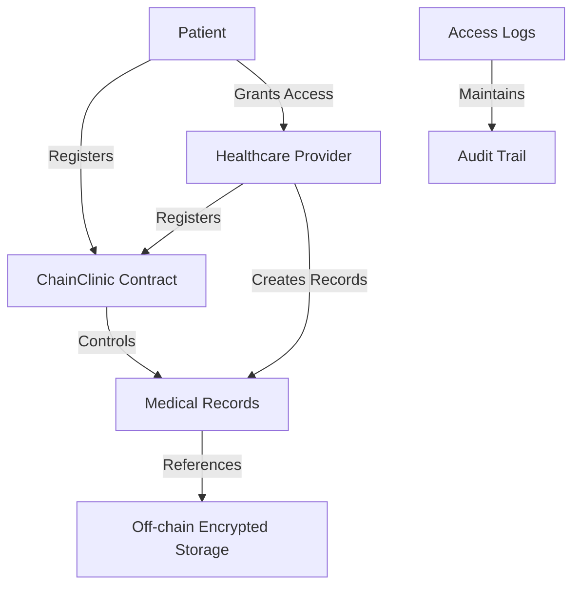

# ChainClinic Medical Records

A decentralized medical records management system built on the Stacks blockchain that empowers patients with complete control over their health data while providing secure access to authorized healthcare providers.

## Overview

ChainClinic is a blockchain-based platform that revolutionizes how medical records are stored, shared, and managed. The system combines on-chain access control with off-chain encrypted storage to ensure both data privacy and accessibility.

### Key Features
- Patient-controlled access management
- Verified healthcare provider registry
- Secure record storage with encryption
- Comprehensive audit logging
- HIPAA-compliant data handling

## Architecture

The system uses a hybrid architecture where:
- Access control and permissions are managed on-chain
- Medical record data is stored off-chain (encrypted)
- Record references and metadata are stored on-chain
- Audit trails are maintained for all access events



## Contract Documentation

### Main Contract: chainclinic-records.clar

The core contract managing all medical record operations and access control.

#### Core Components:
1. **User Management**
   - Patient registration
   - Provider registration and verification
   - User profile management

2. **Access Control**
   - Permission granting/revocation
   - Access verification
   - Role-based restrictions

3. **Record Management**
   - Record creation
   - Record retrieval
   - Patient record indexing

4. **Audit Logging**
   - Access tracking
   - Operation logging
   - Timestamp recording

## Getting Started

### Prerequisites
- Clarinet
- Stacks wallet
- Node.js environment

### Installation
1. Clone the repository
2. Install dependencies
```bash
clarinet install
```

### Basic Usage

1. **Patient Registration**
```clarity
(contract-call? .chainclinic-records register-patient "John Doe")
```

2. **Provider Registration**
```clarity
(contract-call? .chainclinic-records register-provider "Dr. Smith Clinic")
```

3. **Granting Access**
```clarity
(contract-call? .chainclinic-records grant-access 'SP2J6ZY48GV1EZ5V2V5RB9MP66SW86PYKKNRV9EJ7)
```

## Function Reference

### Patient Functions

```clarity
(register-patient (name (string-ascii 100)))
(grant-access (provider principal))
(revoke-access (provider principal))
(get-my-record-ids)
```

### Provider Functions

```clarity
(register-provider (name (string-ascii 100)))
(add-medical-record (record-id (string-ascii 32)) 
                    (patient principal)
                    (record-hash (string-ascii 64))
                    (description (string-ascii 100))
                    (metadata (string-ascii 200)))
(get-patient-record-ids (patient principal))
```

### Administrative Functions

```clarity
(verify-provider (provider principal))
(transfer-ownership (new-owner principal))
```

### Read-Only Functions

```clarity
(check-access-status (patient principal) (provider principal))
(get-user-info (user principal))
```

## Development

### Testing
Run the test suite:
```bash
clarinet test
```

### Local Development
1. Start Clarinet console:
```bash
clarinet console
```

2. Deploy contracts:
```bash
clarinet deploy
```

## Security Considerations

### Data Privacy
- Medical record data must be encrypted before off-chain storage
- Access control must be strictly enforced
- Audit logs should be maintained for compliance

### Access Control
- Only verified providers can create records
- Patients have exclusive control over access grants
- All access attempts are logged and auditable

### Limitations
- On-chain storage limited to metadata and access control
- Provider verification requires trusted administrator
- Access revocation doesn't affect previously accessed data

### Best Practices
- Regular access review by patients
- Immediate access revocation when needed
- Secure key management for off-chain data encryption
- Regular security audits of smart contract